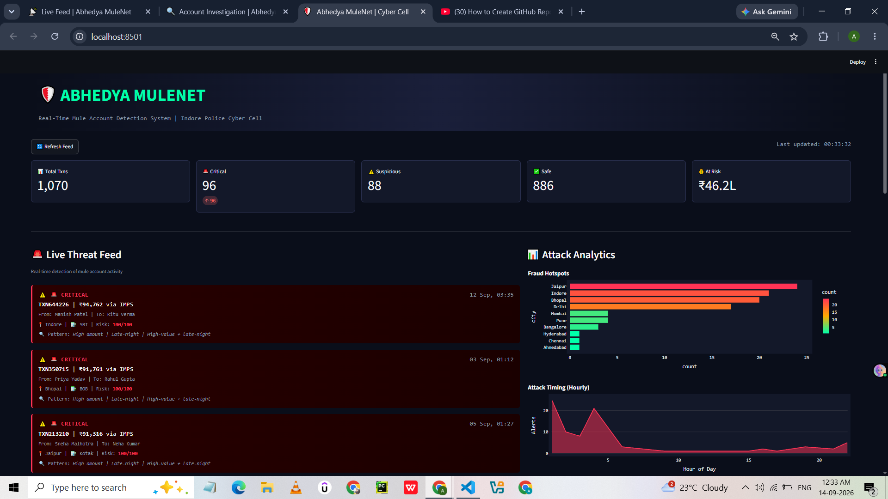
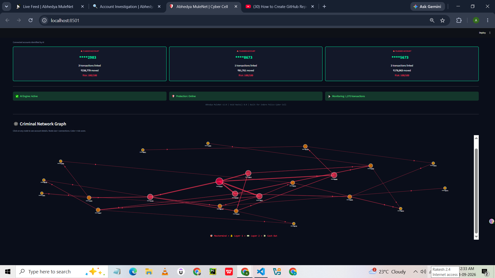
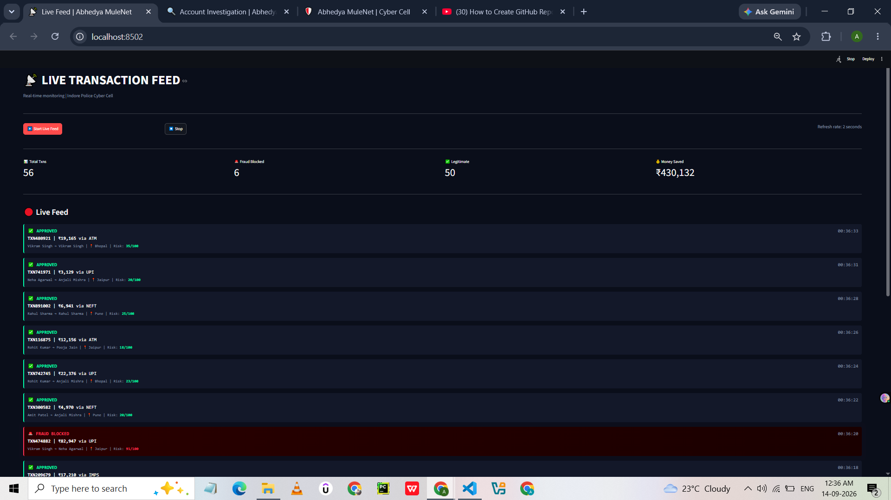
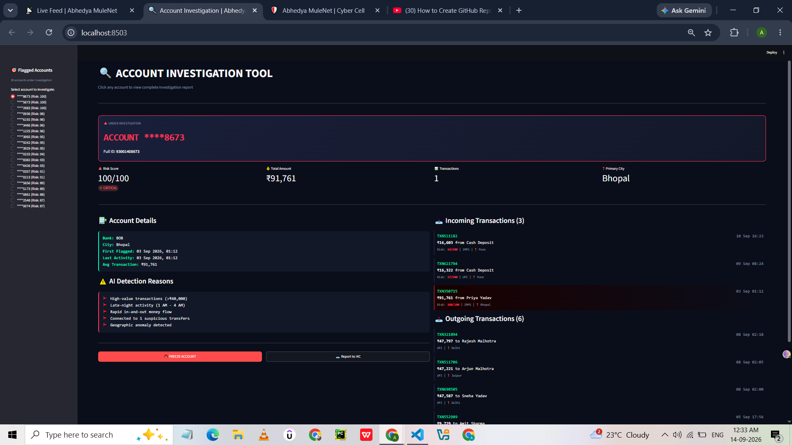

# 🛡️ Abhedya MuleNet

**Real-Time Mule Account Detection & Triage System for a Fraud-Free Indore**


---

## 🎯 The Problem

India is facing an industrial-scale crisis of money laundering through "mule" bank accounts. Criminals rent ordinary people's accounts to layer stolen funds across multiple states, making them nearly impossible to trace.

- **5.2 Lakh+** mule accounts flagged in India (March 2026)
- **₹60+ Crore** lost in Indore (Jan-Aug 2026)
- **7,000+** cyber fraud complaints in Indore
- Supreme Court has directed RBI to create SOP for mule accounts

---

## 💡 Our Solution

A 3-layer intelligence platform for law enforcement:

1. **AI Risk Engine** — Isolation Forest model detects suspicious transactions in real-time
2. **Network Graph Analysis** — Visualizes the entire mule network from mastermind to cash-out
3. **Investigation Dashboard** — Police can monitor, investigate, and freeze accounts instantly

---

## 🛠️ Tech Stack

- **Backend:** Python
- **AI/ML:** scikit-learn (Isolation Forest)
- **Graph Analysis:** NetworkX
- **Frontend:** Streamlit + Plotly
- **Data:** Synthetic transaction dataset

---


## 📸 Screenshots

### Main Dashboard


### Criminal Network Graph


### Live Transaction Feed


### Account Investigation Tool



## 🚀 How to Run

### 1. Clone the repository
```bash
git clone https://github.com/Ajaydangi1509/abhedya-mulenet.git
cd abhedya-mulenet